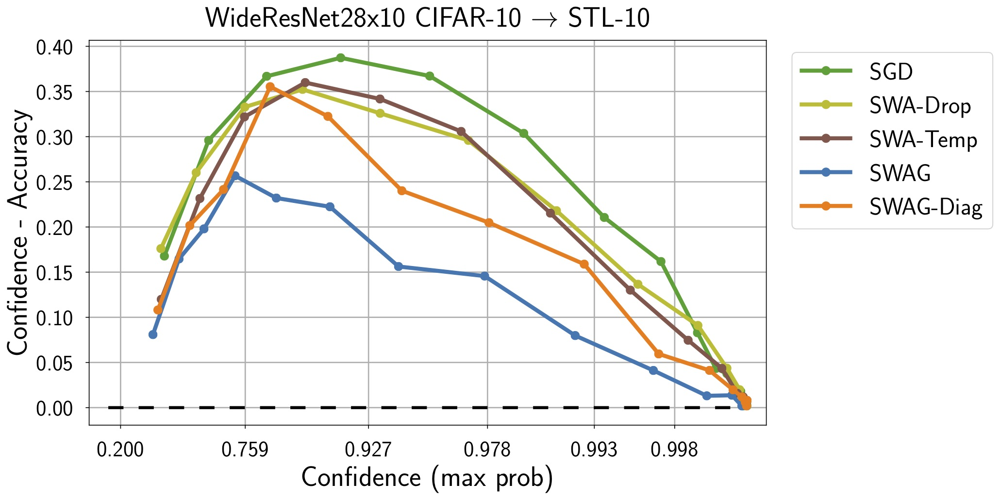
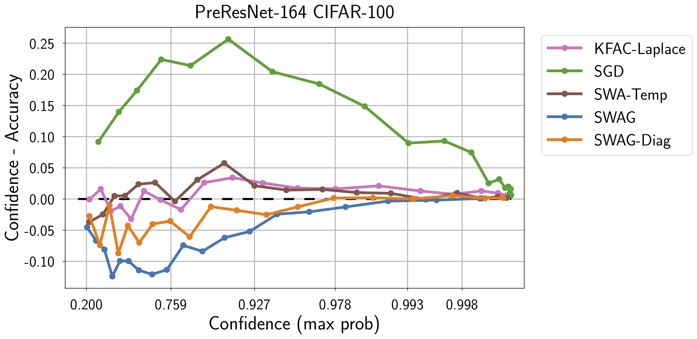

# A Simple Baseline for Bayesian Deep Learning

This repository contains a PyTorch implementation of Stochastic Weight Averaging-Gaussian (SWAG) from the paper

[A Simple Baseline for Bayesian Uncertainty in Deep Learning](https://arxiv.org/abs/1902.02476)

by Wesley Maddox, Timur Garipov, Pavel Izmailov, Dmitry Vetrov, and Andrew Gordon Wilson

## Introduction

SWA-Gaussian (SWAG) is a convenient method for uncertainty representation and calibration in Bayesian deep learning.
The key idea of SWAG is that the SGD iterates, with a modified learning rate schedule, act like samples from a Gaussian distribution; SWAG fits this Gaussian distribution by capturing the [SWA](https://arxiv.org/abs/1803.05407) mean and a covariance matrix, representing the first two moments of SGD iterates. We use this Gaussian distribution as a posterior over neural network weights, and then perform a Bayesian model average, for uncertainty representation and calibration.

<p align="center">
  
  
</p>


In this repo, we implement SWAG for image classification with several different architectures on both CIFAR datasets and ImageNet. We also implement SWAG for semantic segmentation on CamVid using our implementation of a FCDenseNet67.
We additionally include several other experiments on exploring the covariance of the gradients of the SGD iterates, the eigenvalues of the Hessian, and width/PCA decompositions of the SWAG approximate posterior.

CIFAR10 -> STL10             |  CIFAR100
:-------------------------:|:-------------------------:
  |  

Please cite our work if you find it useful:
```bibtex
@inproceedings{maddox_2019_simple,
  title={A simple baseline for bayesian uncertainty in deep learning},
  author={Maddox, Wesley J and Izmailov, Pavel and Garipov, Timur and Vetrov, Dmitry P and Wilson, Andrew Gordon},
  booktitle={Advances in Neural Information Processing Systems},
  pages={13153--13164},
  year={2019}
}
```

## Installation:

```bash
python setup.py develop
```

See requirements.txt file for requirements that came from our setup. We use Pytorch 1.0.0 in our experiments.

Unless otherwise described, all experiments were run on a single GPU. Note that if you are using CUDA 10 you may need to manually install Pytorch with the correct CUDA toolkit.

## File Structure

```
.
+-- swag/
|   +-- posteriors/
    |   +-- swag.py (class definition for SWA, SWAG and SWAG-Diag)
    |   +-- laplace.py (class definition for KFAC Laplace)
|   +-- models/ (Folder with all model definitions)
|   +-- utils.py (utility functions)
+-- experiments/
|   +-- train/ (folder containing standard training scripts for non-ImageNet data)
|   +-- imagenet/ (folder containing ImageNet training scripts)
|   +-- grad_cov/ (gradient covariance and optimal learning rate experiments)      

|   +-- hessian_eigs/ (folder for eigenvalues of hessian)

|   +-- segmentation/ (folder containing training scripts for segmentation experiments)
|   +-- uncertainty/ (folder containing scripts and methods for all uncertainty experiments)
|   +-- width/ (folder containing scripts for PCA and SVD of SGD trajectories)
+-- tests/ (folder containing tests for SWAG sampling and SWAG log-likelihood calculation.)
```

### Example Commands

**See experiments/* for particular READMEs**

[Image Classification](experiments/train/README.md)

[Segmentation](experiments/segmentation/README.md)

[Uncertainty](experiments/uncertainty/README.md)

Some other commands are listed here:

*Hessian eigenvalues*

```cd experiments/hessian_eigs; python run_hess_eigs.py --dataset CIFAR100 --data_path [data_path] --model PreResNet110 --use_test --file [ckpt] --save_path [output.npz] ```

*Gradient covariances*

```cd experiments/grad_cov; python run_grad_cov.py --dataset CIFAR100 --data_path [data_path] --model VGG16 --use_test --epochs=300 --lr_init=0.05 --wd=5e-4 --swa --swa_start 161 --swa_lr=0.01 --grad_cov_start 251 --dir [dir] ```

Note that this will output the gradient covariances onto the console, so you ought to write these into a log file and retrieve them afterwards.

## References for Code Base

Stochastic weight averaging: [Pytorch repo](https://github.com/timgaripov/swa/); most of the base methods and model definitions are built off of this repo.

Model implementations:
  - VGG: https://github.com/pytorch/vision/
  - PreResNet: https://github.com/bearpaw/pytorch-classification
  - WideResNet: https://github.com/meliketoy/wide-resnet.pytorch
  - FCDensenet67: https://github.com/bfortuner/pytorch_tiramisu

Hessian eigenvalue computation: [PyTorch repo](https://github.com/tomgoldstein/loss-landscape), but we ultimately ended up using [GPyTorch](https://gpytorch.ai) as it allows calculation of more eigenvalues.

Segmentation evaluation metrics: [Lasagne repo](https://github.com/SimJeg/FC-DenseNet/blob/master/metrics.py)
